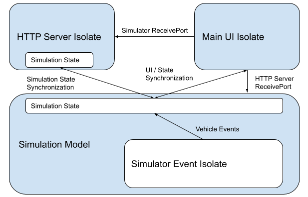
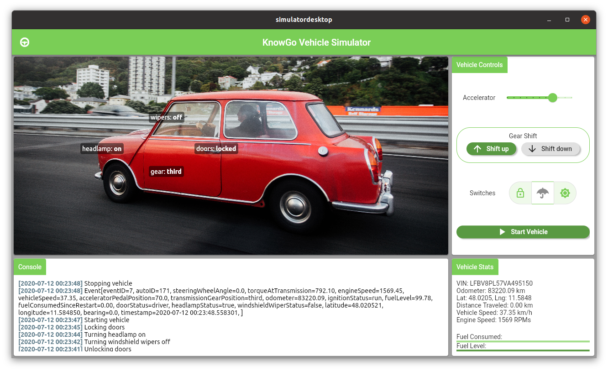

# knowgo-vehicle-simulator

A vehicle simulator for generating [KnowGo] events in Dart.

[KnowGo]: https://knowgo.io

## Overview

The vehicle simulator will generate a single unique vehicle, which can
be controlled either directly through the UI or through a REST API.

The Simulator itself consists of several different components:
- The Vehicle Simulation model
- An `Event isolate` for generating vehicle events
- An `HTTP Server isolate` for exposing a REST API

The `HTTP Server isolate` exposes a REST API for starting/stopping the
vehicle, updating the vehicle state, and for querying vehicle events.

As the simulation state can not be shared directly across the isolates,
the simulation model in the main isolate acts as the source of truth
across the system:
- Updates from the `Event isolate` are applied to the simulation model
  periodically, in line with the event generation frequency: once per
  second by default.
- The `HTTP Server isolate` maintains its own cached copy of the
  simulation state, which is updated with changes from the Event
  isolate, UI interaction, and the REST API. Changes received through
  the REST API are cached in the `HTTP Server isolate` and proxied back
  to the simulation model directly.
- The UI in the `main isolate` is redrawn based on changes to the
  simulation model, triggered by UI interaction and updates from the
  `Event isolate` or `HTTP Server isolate`.

An overview of the overall interactivity patterns is provided below:

## Simulator UI

## Features and bugs

Please file feature requests and bugs at the [issue tracker][tracker].

[tracker]: https://github.com/knowgoio/knowgo-vehicle-simulator/issues

## License

Licensed under the terms of the MIT license, the full version of which
can be found in the [LICENSE][license] file included in the distribution.

[license]: https://raw.githubusercontent.com/knowgoio/knowgo-vehicle-simulator/master/LICENSE