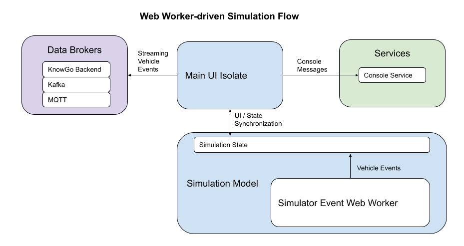

# knowgo-vehicle-simulator

[](https://travis-ci.com/knowgoio/knowgo-vehicle-simulator)
[](https://coveralls.io/github/knowgoio/knowgo-vehicle-simulator?branch=master)

An interactive multi-platform Connected Car simulator for generating
and streaming realistic vehicle telemetry.

## Overview

``knowgo-vehicle-simulator`` has been developed to aid in the
development and validation of data-driven Connected Car services and
models that require easy access to realistic synthetic driving data,
both for static and streaming applications. It was originally designed
for generating event records for the [KnowGo Car] platform, but has
been generalized so that it may be useful both to Connected Car service
developers and researchers.

The vehicle simulator generates a single unique vehicle, which can
be controlled either directly through the UI or through an optional REST
API. This may be further interfaced with OEM-specific external data
sources and models in order to permit the simulation state to act as an
automotive digital twin. For fleet simulation workloads, multiple
instances of the simulator may be run in parallel, with each generated
vehicle being manually joined to a specified fleet.

The Simulator itself consists of several different components:
- The Vehicle Simulation model
- An `Event loop` for generating vehicle events, run as either
  an Isolate or Web Worker depending upon the target platform.
- An optional `HTTP Server isolate` for exposing a REST API with basic
  vehicle controls - starting/stopping the vehicle, updating the
  vehicle state, handling vehicle notifications, and querying vehicle
  events.

As the simulation state can not be shared directly across the isolates,
the simulation model in the main isolate acts as the source of truth
across the system:
- Updates from the `Event loop` are applied to the simulation model
  periodically, in line with the event generation frequency: once
  per second by default.
- The `HTTP Server isolate` maintains its own cached copy of the
  simulation state, which is updated with changes from the Event
  isolate, UI interaction, and the REST API. Changes received through
  the REST API are cached in the `HTTP Server isolate` and proxied back
  to the simulation model directly.
- The UI in the `main isolate` is redrawn based on changes to the
  simulation model, triggered by UI interaction and updates from the
  `Event loop` or `HTTP Server isolate`.

An overview of the overall interactivity patterns for the different
target platforms is provided in the table below:

Flutter Web                       | Other Target Platforms
:--------------------------------:|:----------------------------------:
 | 

## Simulator UI


## Implementation Status

The simulator was originally written for the desktop, and so should
work fine there and on any reasonably-sized tablet.

- [x] Linux desktop
- [x] Windows desktop
- [x] MacOS desktop
- [x] Web
- [x] Android (only tested on a tablet)
- [ ] iOS (untested)

The UI will need to be reworked to run on smaller displays, this is not
a high priority at the moment, but will eventually be implemented.

## Event Publication

By default, generated events are only logged in the console. Events can
be published to a KnowGo API backend, as well as MQTT and Kafka brokers.
The specific configuration for each is outlined below.

## Configuration

Configuration of the simulator can be tuned through a `config.yaml` file,
which will be parsed and updated by configuration changes within the UI.
The format of the file is:

```yaml
sessionLogging: true
eventLogging: true

# Optional KnowGo Backend Configuration
knowgo:
  server: <knowgo-API-server>
  apiKey: <knowgo-API-Key>

# Optional Kafka Broker Configuration
kafka:
  broker: <kafka-broker-address>
  topic: <kafka-topic>

# Optional MQTT Broker Configuration
mqtt:
  broker: <MQTT-broker-address>
  topic: <MQTT-topic>
```

A number of environment variables can also be set:

Environment Variable | Description | Default value
:-------------------|:-----------|:-------------
*KNOWGO_SIMULATOR_CONFIG* | Location of `config.yaml` file | `config.yaml`
*KNOWGO_SIMULATOR_PORT* | HTTP port to bind for REST API | 8086

## Features and bugs

Please file feature requests and bugs at the [issue tracker][tracker].

[tracker]: https://github.com/knowgoio/knowgo-vehicle-simulator/issues

## License

Licensed under the terms of the MIT license, the full version of which
can be found in the [LICENSE][license] file included in the distribution.

[KnowGo Car]: https://knowgo.io
[license]: https://raw.githubusercontent.com/knowgoio/knowgo-vehicle-simulator/master/LICENSE
