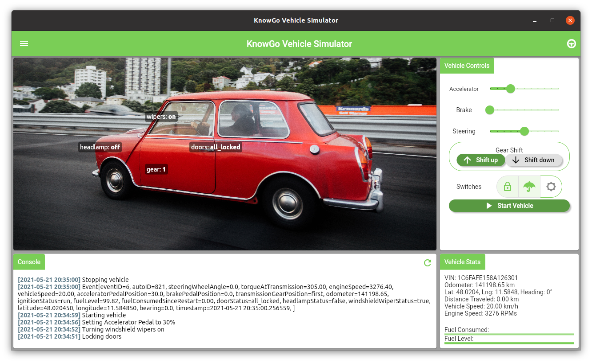

# knowgo-vehicle-simulator

[](https://travis-ci.com/knowgoio/knowgo-vehicle-simulator)


[](https://snapcraft.io/knowgo-vehicle-simulator)
[](https://zenodo.org/badge/latestdoi/274369996)


An interactive multi-platform Connected Car simulator for generating
and streaming realistic vehicle telemetry.

## Overview

``knowgo-vehicle-simulator`` has been developed to aid in the
development and validation of data-driven Connected Car services and
models that require easy access to realistic synthetic driving data,
both for static and streaming applications. It was originally designed
for generating event records for the [KnowGo Car] platform, but has
been generalized so that it may be useful both to Connected Car service
developers and researchers.

The vehicle simulator generates a single unique vehicle, which can
be controlled either directly through the UI or through an optional
[REST API]. This may be further interfaced with OEM-specific external
data sources and models in order to permit the simulation state to act
as an automotive digital twin. For fleet simulation workloads, multiple
instances of the simulator may be run in parallel, with each generated
vehicle being manually joined to a specified fleet.

### Live Demo

A live demonstration of the Simulator is available [here][live-demo].

[live-demo]: https://knowgoio.github.io/knowgo-vehicle-simulator

### Installation

Installation from a binary release is recommended. Regular releases are
made to various app stores, please refer to the one appropriate for
your platform:

[](https://snapcraft.io/knowgo-vehicle-simulator)
[](https://www.microsoft.com/store/apps/9N70DBN4ZX3W?ocid=badge)
<a href='https://play.google.com/store/apps/details?id=io.knowgo.vehicle.simulator&pcampaignid=pcampaignidMKT-Other-global-all-co-prtnr-py-PartBadge-Mar2515-1'></a>

Releases can also be obtained directly from [GitHub][releases].

[releases]: https://github.com/knowgoio/knowgo-vehicle-simulator/releases

### Deployment

For deployment of a self-contained web-based instance of the simulator,
a number of deployment options have been provided:

#### Docker

Multi-arch images are provided under [adaptant/knowgo-vehicle-simulator].
The image can be run directly as:

```
$ docker run -p 8086:8086 adaptant/knowgo-vehicle-simulator
```

[adaptant/knowgo-vehicle-simulator]: https://hub.docker.com/repository/docker/adaptant/knowgo-vehicle-simulator

#### Kubernetes

To create a Kubernetes `Deployment` including a single instance of the
simulator:

```
$ kubectl apply -f https://raw.githubusercontent.com/knowgoio/knowgo-vehicle-simulator/simulator-deployment.yaml
```

An optional `Service` exposing the simulator port on the cluster can
also be applied:

```
$ kubectl apply -f https://raw.githubusercontent.com/knowgoio/knowgo-vehicle-simulator/simulator-service.yaml
```

### Simulator UI



## Documentation

For additional documentation and tutorials, please refer to the [documentation].

[documentation]: https://knowgoio.github.io/knowgo-vehicle-simulator/docs

### Postman Collection for Simulator REST API

A Postman Collection and pre-configured environment for interacting
with the Simulator [REST API] in a local simulation environment is
available [here][postman-collections].

[postman-collections]: https://github.com/knowgoio/knowgo-postman-collections

## Architecture 
The Simulator itself consists of several different components:
- The Vehicle Simulation model
- An `Event loop` for generating vehicle events, run as either
  an Isolate or Web Worker depending upon the target platform.
- An optional `HTTP Server isolate` for exposing a REST API with basic
  vehicle controls - starting/stopping the vehicle, updating the
  vehicle state, handling vehicle notifications, and querying vehicle
  events.

As the simulation state can not be shared directly across the isolates,
the simulation model in the main isolate acts as the source of truth
across the system:
- Updates from the `Event loop` are applied to the simulation model
  periodically, in line with the event generation frequency: once
  per second by default.
- The `HTTP Server isolate` maintains its own cached copy of the
  simulation state, which is updated with changes from the Event
  isolate, UI interaction, and the REST API. Changes received through
  the REST API are cached in the `HTTP Server isolate` and proxied back
  to the simulation model directly.
- The UI in the `main isolate` is redrawn based on changes to the
  simulation model, triggered by UI interaction and updates from the
  `Event loop` or `HTTP Server isolate`.

An overview of the overall interactivity patterns for the different
target platforms is provided in the table below:

Flutter Web                       | Other Target Platforms
:--------------------------------:|:----------------------------------:
 | 

## Implementation Status

- [x] Linux desktop
- [x] Windows desktop
- [x] MacOS desktop
- [x] Web
- [x] Android
- [ ] iOS (untested)

## Event Publication

By default, generated events are only logged in the console. Events can
be published to a custom notification endpoint, a KnowGo API backend,
as well as MQTT and Kafka brokers (as well as any combination thereof).
The specific configuration for each is outlined below.

## Configuration

Configuration of the simulator can be tuned through a `config.yaml`
file, which will be parsed and updated by configuration changes within
the UI. The format of the file is:

```yaml
sessionLogging: true
eventLogging: true

# Allow unauthenticated requests to REST API
allowUnauthenticated: true

# Optional endpoint to post generated events to
notificationUrl: http://myserver.com/endpoint

# Optional KnowGo Backend Configuration
knowgo:
  server: <knowgo-API-server>
  apiKey: <knowgo-API-Key>

# Optional Kafka Broker Configuration
kafka:
  broker: <kafka-broker-address>
  topic: <kafka-topic>

# Optional MQTT Broker Configuration
mqtt:
  broker: <MQTT-broker-address>
  topic: <MQTT-topic>
```

A number of environment variables can also be set:

Environment Variable | Description | Default value
:-------------------|:-----------|:-------------
*KNOWGO_VEHICLE_SIMULATOR_CONFIG* | Path to config file | `<appDocDir>/knowgo_vehicle_simulator/config.yaml`
*KNOWGO_VEHICLE_SIMULATOR_LOGS* | Path to log directory | `<appDocDir>/knowgo_vehicle_simulator/logs`
*KNOWGO_VEHICLE_SIMULATOR_PORT* | HTTP port to bind for REST API | 8086
*KNOWGO_SIGNING_KEY* | Signing and validation secret for API keys | secret-key

## Features and bugs

Please file feature requests and bugs at the [issue tracker][tracker].

[tracker]: https://github.com/knowgoio/knowgo-vehicle-simulator/issues

## License

Licensed under the terms of the MIT license, the full version of which
can be found in the [LICENSE][license] file included in the distribution.

[KnowGo Car]: https://knowgo.io
[REST API]: https://knowgoio.github.io/knowgo-vehicle-simulator/rest-api/
[license]: https://raw.githubusercontent.com/knowgoio/knowgo-vehicle-simulator/master/LICENSE
