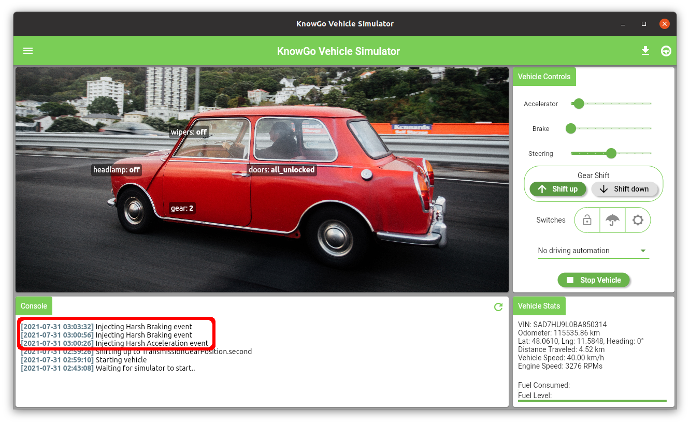

# Event Injection

During simulation runs, it can be advantageous to deterministically
trigger events (such as harsh acceleration or hash braking) at fixed
times throughout the journey timeline. To facilitate this kind of event
modelling, the triggering of pre-configured events into the running
simulation model is supported via event injection.

A brief overview of how to get started with run-time event injection is
provided in the following tutorial video:

<iframe width="560" height="315" src="https://www.youtube-nocookie.com/embed/h5v99crqHZg" title="YouTube video player" frameborder="0" allow="accelerometer; autoplay; clipboard-write; encrypted-media; gyroscope; picture-in-picture" allowfullscreen></iframe>

At present, event injection events are modelled after a subset of
[webhook](/webhooks/) event triggers. These are briefly outlined in
the table below:

| 
Event
 | Description            |
|----------------------------|------------------------------------|
| `harsh_acceleration`       | Trigger abrupt changes in the accelerator pedal position. |
| `harsh_braking`            | Trigger abrupt changes in the brake pedal position. |

## Event Modelling

Event injection modelling is carried out under the event injection view,
this can be navigated to by selecting `Event Injection` from the
configuration drawer:

This will then navigate to the `Event Injection` view, from which events
can be selected, configured, and added to the event timeline:

Note that the injection time itself is relative to the simulation start
time, and will persist across runs. Each simulation stop/start cycle
will reset the injection timers, with any premature stopping of the
simulation automatically cancelling the remaining injection events.

As multiple events are scheduled, they will automatically appear in the
timeline view:

events in the timeline view can further be temporarily disabled or
deleted outright before returning to the simulation view.

With a number of events now modelled, run the simulator as normal.
At the prescribed intervals, the defined events will be injected into
the running simulation:

Each of the injected events will be combined together with the event
update received from the vehicle dynamics model, and will automatically
update the simulation UI when the events are injected. If configured,
[webhook notifications](/webhooks/) will also be triggered for each of
the injected events.
