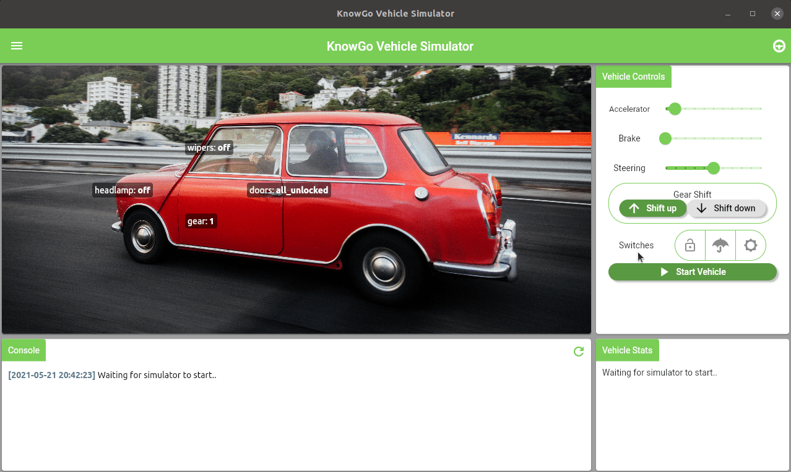

# Getting Started

!!! note
    In case you run into any problems, [contact us][contact] directly
    or open an issue in the [issue tracker][tracker].

[contact]: mailto:labs@adaptant.io
[tracker]: https://github.com/knowgoio/knowgo-vehicle-simulator/issues

## Installation

Installation from a binary release is recommended. Regular releases are
made to various app stores, please refer to the one appropriate for
your platform:

[](https://snapcraft.io/knowgo-vehicle-simulator)
<a href='https://www.microsoft.com/store/apps/9N70DBN4ZX3W?cid=storebadge&ocid=badge'></a>
<a href='https://play.google.com/store/apps/details?id=io.knowgo.vehicle.simulator&pcampaignid=pcampaignidMKT-Other-global-all-co-prtnr-py-PartBadge-Mar2515-1'></a>

Releases can also be obtained directly from [GitHub][releases].

[releases]: https://github.com/knowgoio/knowgo-vehicle-simulator/releases

## Deployment

For deployment of a self-contained web-based instance of the simulator,
a number of deployment options have been provided:

### Docker

Multi-arch images are provided under [knowgo/knowgo-vehicle-simulator].
The image can be run directly as:

```
$ docker run -p 8086:8086 knowgo/knowgo-vehicle-simulator
```

[knowgo/knowgo-vehicle-simulator]: https://hub.docker.com/repository/docker/knowgo/knowgo-vehicle-simulator

### Kubernetes

To create a Kubernetes `Deployment` including a single instance of the
simulator:

```
$ kubectl apply -f https://raw.githubusercontent.com/knowgoio/knowgo-vehicle-simulator/simulator-deployment.yaml
```

An optional `Service` exposing the simulator port on the cluster can
also be applied:

```
$ kubectl apply -f https://raw.githubusercontent.com/knowgoio/knowgo-vehicle-simulator/simulator-service.yaml
```

## Usage



## Configuration

Configuration of the simulator can be tuned through a `config.yaml`
file, which will be parsed and updated by configuration changes within
the UI. The format of the file is:

```yaml
sessionLogging: true
eventLogging: true

# Allow unauthenticated requests to REST API
allowUnauthenticated: true

# Optional endpoint to post generated events to
notificationUrl: http://myserver.com/endpoint

# Optional KnowGo Backend Configuration
knowgo:
  server: <knowgo-API-server>
  apiKey: <knowgo-API-Key>

# Optional Kafka Broker Configuration
kafka:
  broker: <kafka-broker-address>
  topic: <kafka-topic>

# Optional MQTT Broker Configuration
mqtt:
  broker: <MQTT-broker-address>
  topic: <MQTT-topic>
```

A number of environment variables can also be set:

Environment Variable | Description | Default value
:-------------------|:-----------|:-------------
*KNOWGO_VEHICLE_SIMULATOR_CONFIG* | Path to config file | `<appDocDir>/knowgo_vehicle_simulator/config.yaml`
*KNOWGO_VEHICLE_SIMULATOR_LOGS* | Path to log directory | `<appDocDir>/knowgo_vehicle_simulator/logs`
*KNOWGO_VEHICLE_SIMULATOR_PORT* | HTTP port to bind for REST API | 8086
*KNOWGO_SIGNING_KEY* | Signing and validation secret for API keys | secret-key
