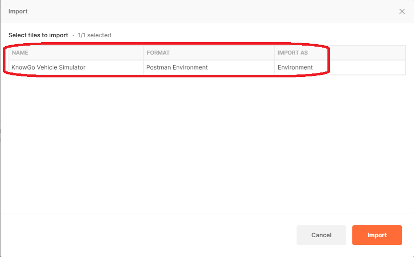
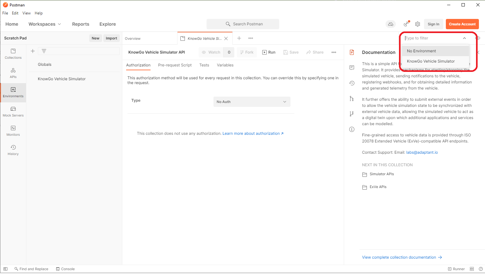

# REST API Tutorial

The KnowGo Vehicle Simulator REST API can be interacted with in a number
of different ways:

- Through [Postman](#Postman) with the provided collections and
  environments.
- Directly from the [OpenAPI](#OpenAPI) specification

These are elaborated in more detail in the sections below.

!!! note
    As parts of the REST API require API responses to be captured and
    used as inputs in other requests, we recommend using the provided
    Postman configuration where this process has been automated for you.

By default, each of these methods of interaction expect to communicate
with an instance of the simulator running on your local machine; each
method has, therefore, been pre-configured with a local environment in
mind.

## Postman Tutorial

### Step 1: Downloading and Installing Postman

Having a valid Postman environment is a prerequisite for continuing on
with the remaining steps. Postman can either be downloaded and installed
locally, or used in the browser. Please proceed to the Postman download
page to complete this step.

[Download Postman](https://www.postman.com/downloads/){ .md-button }

### Step 2: Downloading the KnowGo Postman Collection

We have developed a comprehensive Postman Collection that includes
requests, sample payloads/return values, and validation for all of the
defined APIs exposed by the simulator. A pre-configured environment for
interacting with the simulator running locally on your machine has also
been provided. These can be obtained directly from our GitHub page:

[Download the collection](https://github.com/knowgoio/knowgo-postman-collections){ .md-button .md-button--primary }

Both the collection and environment are continuously synchronized with
any changes made to the REST API. As the REST API is still under active
development, please ensure you are always using the latest version in
order to avoid API conflicts or other types of undefined behaviour.

!!! note
    The simulator does not expose different versions of the REST API and
    will always serve the latest version.

### Step 3: Importing the Collection and Configuring the Environment

When launching Postman for the first time, you will be greeted with the
Scratch Pad workspace, in which all changes are kept only on your local
machine. From here, the collection can be imported by navigating to the
import button:

From here, navigate to wherever you have cloned or otherwise downloaded
the collection and select the
`knowgo_vehicle_simulator_api.postman_collection.json` file:

After this, you should see the name of the collection and that Postman
has recognized it as a valid Collection for import. Click on the import
button to proceed:

You should now see the `KnowGo Vehicle Simulator API` in your list of
collections:

After this step, the collection has been successfully imported, but no
environment has yet been assigned. The environment definition can now be
imported. First, select `Environments` from the panel on the left, then
proceed with the import as before, this time selecting the corresponding
`knowgo_vehicle_simulator_api.postman_environment.json` file:

At this point, the environment definition should be recognized as a
valid Environment definition:

The final step is to now set the `KnowGo Vehicle Simulator` environment
as the active environment. This is accomplished by selecting it from the
environment drop-down menu on the top right:

*You are now ready to start issuing REST API requests to the simulator.*

### Step 4: Making REST API Requests to the Simulator

Many of the API requests require IDs that are either statically
configured or dynamically generated by the Simulator. Postman
automatically sets these values in your environment for you when queries
are issued in-order, allowing you to forego the need for any copying and
pasting of identifiers.

Before we can begin issuing queries for specific vehicle data, however,
we first need to obtain the vehicle ID. The vehicle ID is populated when
the Simulator is launched, and will have been either assigned through
the configuration file or dynamically generated by the Simulator. Note
that the vehicle does not need to be running in order for this
information to be obtained, it is sufficient just to have the Simulator
app open.

### Step 5: Configuring Webhooks

The Simulator allows for a number of different webhooks to be registered,
utilizing any combination of event triggers and notification endpoints.
The available webhooks are described in more detail on the webhooks
page:

[See available webhooks](webhooks.md){ .md-button }

By default, the Simulator provides support for all available event
triggers. In a production setting, these are more likely to be
constrained both by resource availability and driver consent, so
applications should similarly endeavour to constrain their scope to the
bare minimum required.

The most straightforward way to visualize receipt of webhook
notifications is by setting up a simple echo server.

## OpenAPI Tutorial

Please refer directly to the [REST API](rest-api.md) specification.
